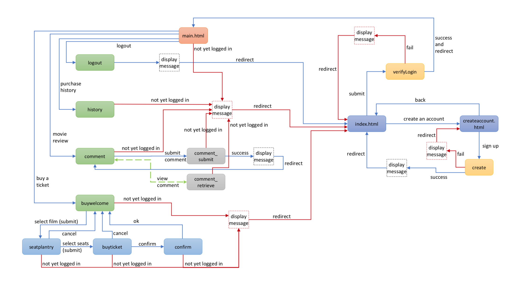
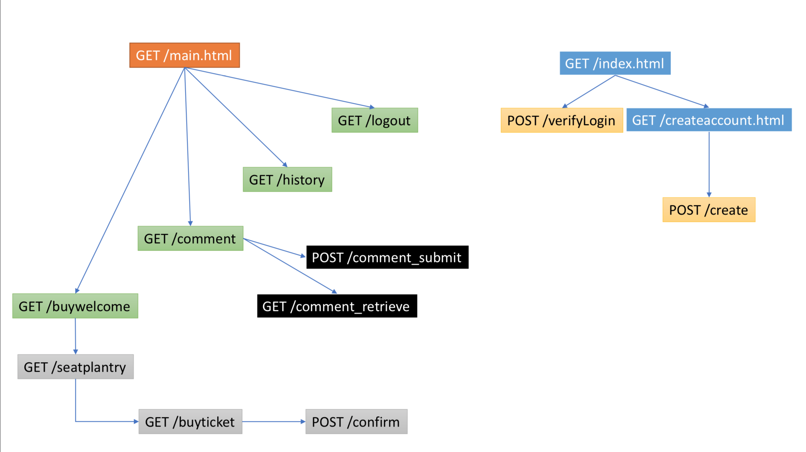
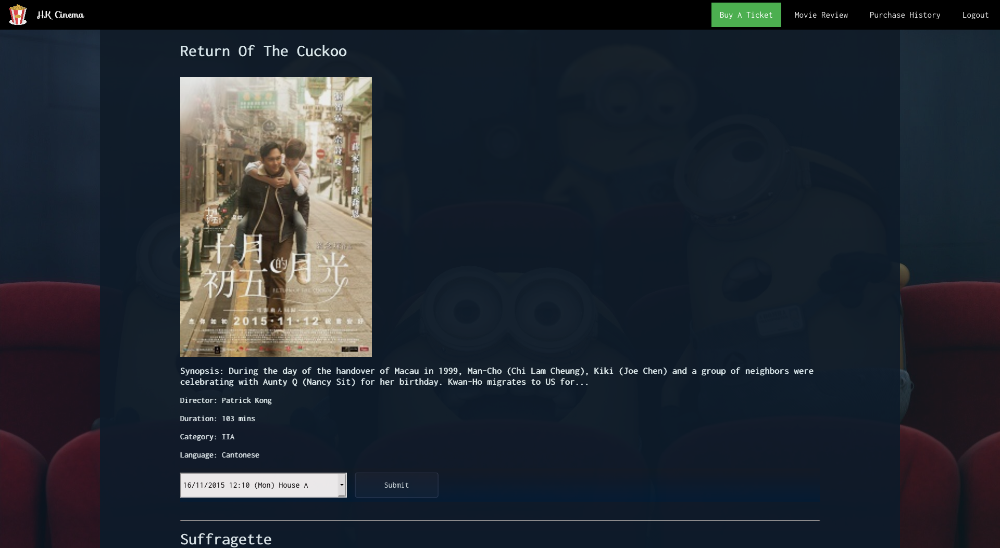
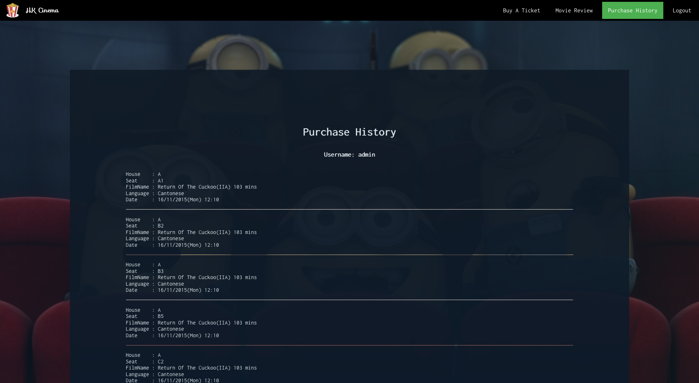

# Cinema Website (Express.js)

It is an online cinema ticket ordering, movie reviewing and purchase history reviewing system that supports registered users to:

* buy cinema ticket(s) according to their own preferences and seat availability;
* give comments and view other users’ comments on the selected film(s);
* view their own ticketing history.

Different techniques and technologies, which include **Pug, CSS,  Responsive Web Design, JavaScript, AJAX, Node.js, Express.js, and MongoDB**, are used to construct and implement different web pages for collecting users’ input from the client side and to retrieve data from the server side that corresponds to users’ input.


## Structure of the website





| Feature          | Files requested                                     |
| ---------------- | --------------------------------------------------- |
| Buy A Ticket     | “buywelcome”, “seatplantry”, “buyticket”, “confirm” |
| Movie Review     | “comment”, “comment_submit”, “comment_retrieve”     |
| Purchase History | “history”                                           |
| Logout           | “logout”                                            |


## Database scheme

```javascript
var loginSchema = new Schema({
  'UserID': String,
  'PW': String
});
var filmSchema = new Schema({
  'FilmID': Number,
  'FilmName': String,
  'Duration': String,
  'Category': String,
  'Language': String,
  'Director': String,
  'Description': String,
  'PosterName': String,
  'BroadCastID': Number,
  'Dates': String,
  'Time': String,
  'HouseID': String,
  'Day': String
});
var houseSchema = new Schema({
  'HouseID': String,
  'HouseRow': Number,
  'HouseCol': Number
});
var ticketSchema = new Schema({
  'SeatNo': String,
  'BroadCastID': Number,
  'Valid': Boolean,
  'UserID': String,
  'TicketType': String,
  'TicketFee': Number
});
var commentSchema = new Schema({
  'UserID': String,
  'FilmID': Number,
  'Comment': String
});
```


## How to use?

After installed MongoDB and Node.js, execute

```bash
 mongod --dbpath xxxxxxx/src/data
 cd xxxxxxx/src
 npm start
```

Then, assess [localhost:3000](localhost:3000).


## Screenshots






## Demo

[HK Cinema](https://i.cs.hku.hk/~h3538087/project1/)
