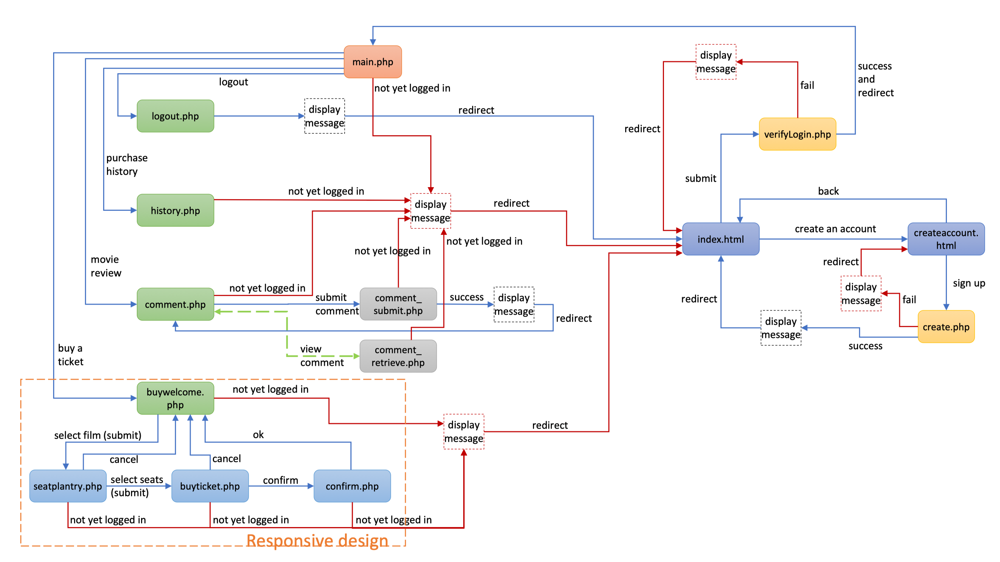
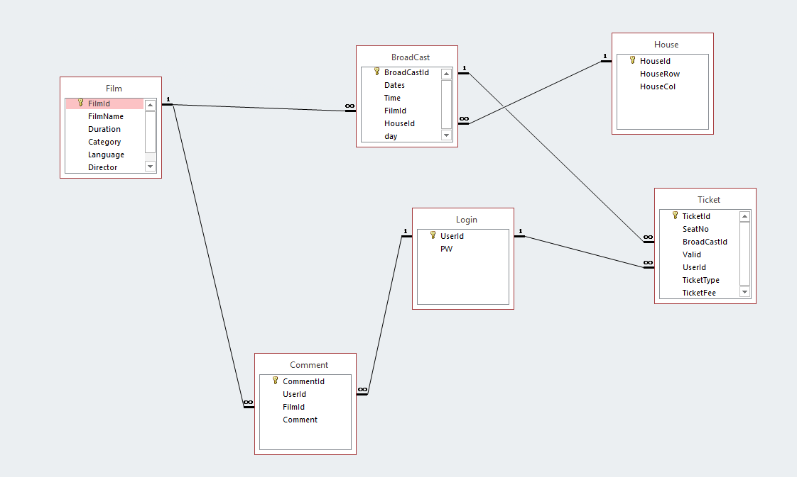
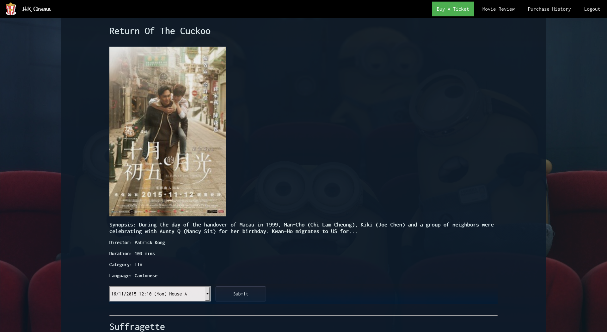
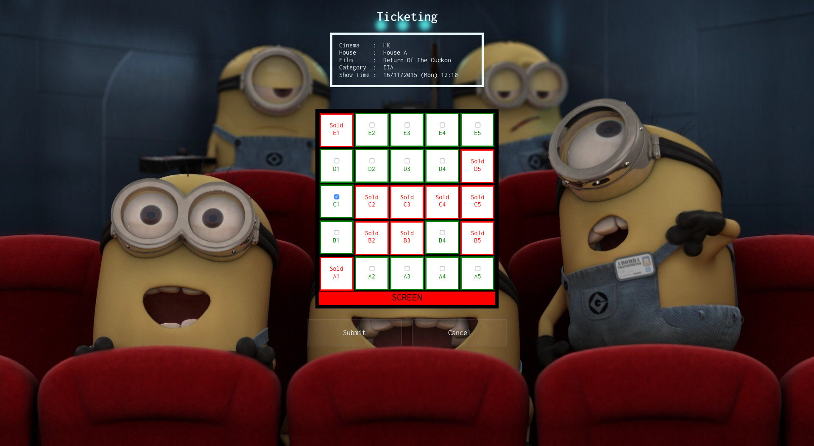
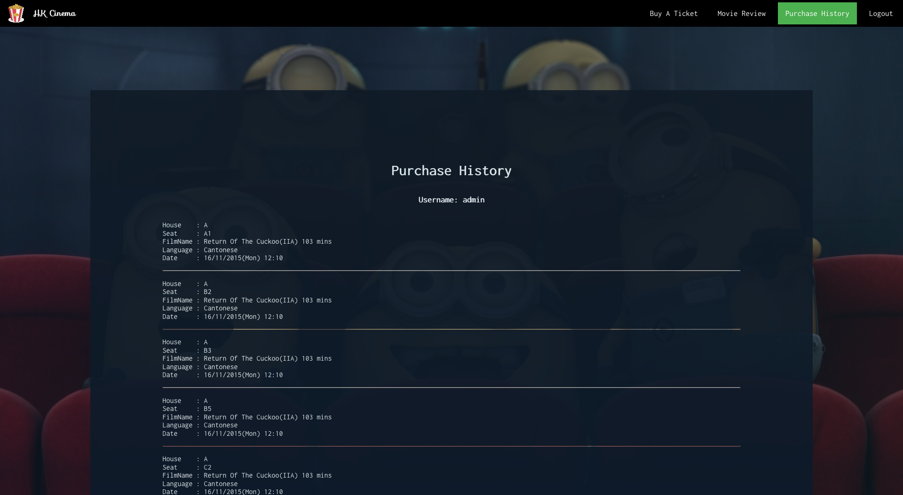

# Cinema Website
It is an online cinema ticket ordering, movie reviewing and purchase history reviewing system that supports registered users to:
* buy cinema ticket(s) according to their own preferences and seat availability;
* give comments and view other users’ comments on the selected film(s);
* view their own ticketing history.

Different techniques and technologies, which include **HTML, CSS,  Responsive Web Design, JavaScript, MySQL, AJAX, and PHP**, are used to construct and implement different web pages for collecting users’ input from the client side and to retrieve data from the server side that corresponds to users’ input.

## Structure of the website

Feature | Files requested 
--- | ---
Buy A Ticket | “buywelcome.php”, “seatplantry.php”, “buyticket.php”, “confirm.php”
Movie Review | “comment.php”, “comment_submit.php”, “comment_retrieve.php”
Purchase History | “history.php”
Logout | “logout.php”

## Database scheme

## How to use?
1. Create a database scheme in a MySQL server and insert data.
2. Replace your database server, name, password, database name in `mysqli_connect(host,username,password,dbname)`.
3. Upload the files to your server.

## Screenshots

## Demo
[HK Cinema](https://i.cs.hku.hk/~h3538087/project1/)